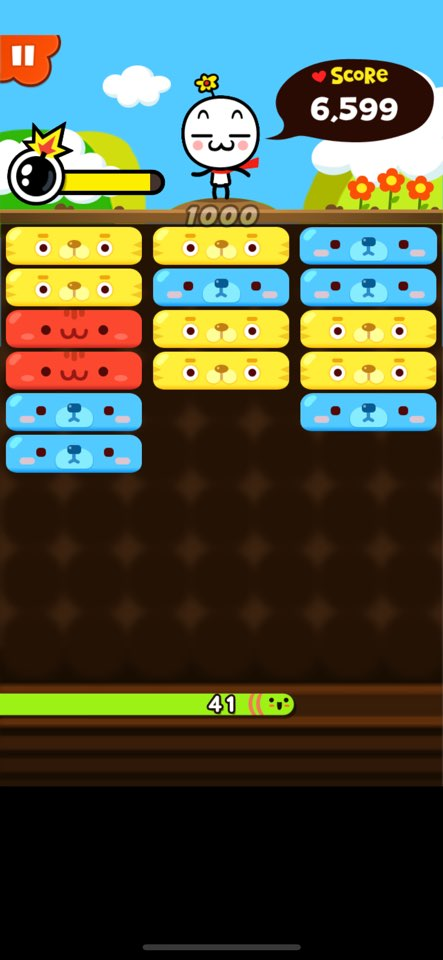

* 아쿠의 치매예방
    * 게임방법
        > 3X4의 칸에서 약 1초동안 카드가 보이고 같은 모양을 연속해서 터치하는 것으로 게임을 플레이 한다. 다른 모양의 카드를 연속해서 터치하였을 경우에는 약 1초간 딜레이가 생기며 새로운 카드로 재편성 된다. 시간제한이 다 되면 게임오버된다.
    * 그래픽
      
    * 게임아이템
        * 정리정돈(900) : 맞추기 쉬운 배열이 등장
        * 보너스 타임(700) : 5초 더 플레이한다
        * 왕초보(1000) : 카드가 16종 중에서 6종만 나온다
        * 슈퍼피버 시작(보석 1) : 슈퍼피버로 시작한다
* 삼촌의 니편내편
    * 게임방법
        > 한줄로 정렬된 캐릭터를 동일한 캐릭터가 있는 좌우방향으로 터치하여 진행한다. 잘못 터치하였을 경우 약 1초의 딜레이가 생기게 된다. 시간제한이 다 되면 게임오버가 된다.
    * 그래픽
    
    * 게임아이템
        * 보너스 타임(700) : 5초 더 플레이한다
        * 변신(900) : 모두 같은 모습이 된다
        * 스피드(1100) : 틀렸을때의 딜레이가 줄어듬
        * 슈퍼피버시작(보석 1) : 슈퍼피버로 시작한다
* 조카의 뿅뿅뿅
    * 게임방법
        > 아이콘들이 7X7로 나오며 각 모양과 색깔이 다르며 같은 모양의 아이콘이 3개 이상 모인 곳을 터치하면 3개 이상 모인 아이콘들이 사라지고 위에서 새로운 블럭이 내려오면서 게임이 진해된다. 잘못 터치하여 3개이상 모이지 않은 아이콘을 터치하였을 경우 약 1초간 딜레이가 생긴다. 시간제한이 다 되면 게임오버가 된다.
    * 그래픽
    
    * 게임아이템
        * 보너스 타임(700) : 5초 더 플레이한다
        * 무지개(1100) : 모든 색과 모양이 적용되는 무지개 빛 아이콘이 생성된다
        * 천사의 날개(900) : 주변의 블럭이 같은 블록이 된다
        * 슈퍼피버시작(보석 1) : 슈퍼피버로 시작한다
* 할배의 길찾기
    * 게임방법
        > 5X5칸에 총 4쌍의 아이콘이 생성이 된다. 같은 모양의 아이콘을 드래그 방식으로 선을 연결하여 전부 다 연결하는 방식으로 게임이 진행된다. 시간제한이 다 되면 게임오버가 된다.
    * 그래픽
    
    * 게임아이템
        * 명탐정(1000) : 나오는 아이콘들 중 하나를 정답으로 연결된 점선을 보여준다
        * 보너스 타임(700) : 5초 더 플레이한다
        * 차렷(1200) : 맞추기 쉬운 배열로 아이콘들이 등장하게 된다
        * 슈퍼피버시작(보석 1) : 슈퍼피버로 시작한다
* 엄마의 삼단정리
    * 게임방법
        > 3줄로 나열 된 곳에 무작위 갯수의 각각의 다른 색깔의 블럭이 생성이 된다. 한 줄을 터치하면 그 줄의 가장 밑에 있는 블럭이 활성화가 되고 그 줄외에 다른 줄을 터치하게 되면 활성화된 블럭이 두번째로 터치된 줄로 이동하게 된다. 이렇게 같은 색깔의 블럭을 한줄에 3개를 쌓으면 이 3개의 블럭이 사라지게 되며 점수가 들어온다. 그리고 밑에 있는 시간 표시줄을 터치하면 위에서 새로운 블럭이 생성되면서 내려오게 된다. 위에서 부터 쌓인 블럭이 하단에 닿이게 될 경우 게임오버 시간제한이 끝나도 게임오버이다.
    * 그래픽
    
    * 게임아이템
        * 핵폭탄(1100) : 폭탄블록으로 인해 블럭이 사라지는 범위가 더욱 커지게 된다.
        * 뿅망치(900) : 터치하여 활성화 되는 블럭이 사라진다
        * 한줄뿅(800) : 한줄에 있는 블럭을 모두 없앨 수 있다
        * 슈퍼피버시작(보석 1) : 슈퍼피버로 시작한다
* 막내의 차곡차곡
    * 게임방법
        > 왼쪽에 나오는 예시가 있고 아래 하단의 세 버튼을 사용하여 아래쪽부터 쌓아서 예시와 똑같이 만드는 방식으로 진행된다. 만약 틀렸을 경우에는 약 1초간의 딜레이와 쌓았던 것이 초기화 되게 된다. 시간제한이 다 될경우 게임 오버이다.
    * 그래픽
    
    * 게임아이템
        * 보너스타임(700) : 5초 더 플레이한다
        * 실수방지(1200) : 최대 3번 틀렸을 경우를 무시한다
        * 초보자(900) : 등장하는 예시의 난이도가 낮아지게 된다
        * 슈퍼피버시작(보석 1) : 슈퍼피버로 시작한다
* 외삼촌의 왕상하이
    * 게임방법
        > 작은 6개의 블럭이 나올 수 있는 밑에서 등장하는 무작위로 쌓인 블럭들중에 바로 붙어있거나 아니면 다른 블럭에 막히지 않고 연결될 수 있는 같은 모양의 블럭을 연속해서 터치하면 그 블럭들이 사라지고 이 블럭들이 사라지면서 이 사라진 블럭들로 인해 변동된 블럭들 중 면끼리 만나게 된 같은 모양 블럭들도 사라지게 된다. 밑에 시간 표시줄을 터치하면 밑에서 부터 블럭이 한줄 재생성 되어 나온다. 이 게임은 연속해서 다른 블럭을 선택해도 활성화된 블럭이 바뀔뿐 실수 패널티는 존재하지 않는다. 시간이 다 될 경우 게임오버가 된다.
    * 그래픽    
    * 게임아이템
        * 뿅망치(900) : 누르는 모든 블럭을 없애게 할 수 있다
        * 방패(1200) : 블럭이 쌓이는것을 1회 막아준다
        * 핵폭탄(1100) : 폭탄블록으로 인해 블럭이 사라지는 범위가 더욱 커지게 된다
        * 슈퍼피버시작(보석 1) : 슈퍼피버로 시작한다
* 아가의 미아찾기
    * 게임방법
        > 5X5규모에서 얼굴 색깔과 모자의 색깔이 다른 아이콘들이 나오게 된다. 아이콘을 터치하면 그 아이콘의 얼굴 색깔과 모자의 색깔이 바뀌게 되는데 이렇게 얼굴색깔이 같은 3개를 한 줄로 만들면 그 아이콘들이 사라지고 위에서 새로운 아이콘들이 새롭게 나오게된다. 아이콘들이 사라지면서 세개의 같은 얼굴색깔이 같은 아이콘들이 이어졌을 경우 그 아이콘들도 사라지게 된다. 제한시간이 다 되면 게임오버가 된다
    * 그래픽     
    * 게임아이템
        * 뿅망치(1100) : 나오는 모든 아이콘들을 터치하여 없앨 수 있다
        * 보너스타임(1000) : 5초 더 플레이한다
        * 빠른힌트(500) : 제공되는 힌트가 더욱 빨리 나오게 된다
        * 슈퍼피버시작(보석 1) : 슈퍼피버로 시작한다
* 큰 형의 날아라
    * 게임방법
        > 게임을 시작하면 새 모양의 캐릭터가 나오고 홀드를 하고 있으면 새가 위로 날아오르게 되고 손을 때게되면 새가 아래로 향하게 된다. 이를 이용하여 앞에서 다가오는 장애물을 피해가면서 오징어와 생선모양을 하고 있는 것에 새 캐릭턱가 닿이면서 점수가 오르게 된다. 만약 장애물에 새 캐릭터가 부딪히게 되면 새 캐릭터는 약 1초간 딜레이에 빠지며 장애물은 부서지게 된다. 제한시간이 다 되면 게임오버가 된다.
    * 그래픽     
    * 게임아이템
        * 자석(900) : 새 캐릭터 주변의 점수를 올릴 수 있는 것을 먹을 수 있게 해주는 아이템 자석의 범위, 유지시간이 증가하고 등장확률이 올라간다
        * 방어(1000) : 장애물을 무시하게 만들어주는 방어 아이템의 등장확률이 올라가게 된다
        * 로켓(1200) : 획득할 경우 일정시간 동안 속도가 빨라지며 무적이 되는 로켓의 유지시간이 길어지며, 등장확률이 올라간다
        * 슈퍼피버시작(보석 1) : 슈퍼피버로 시작한다
