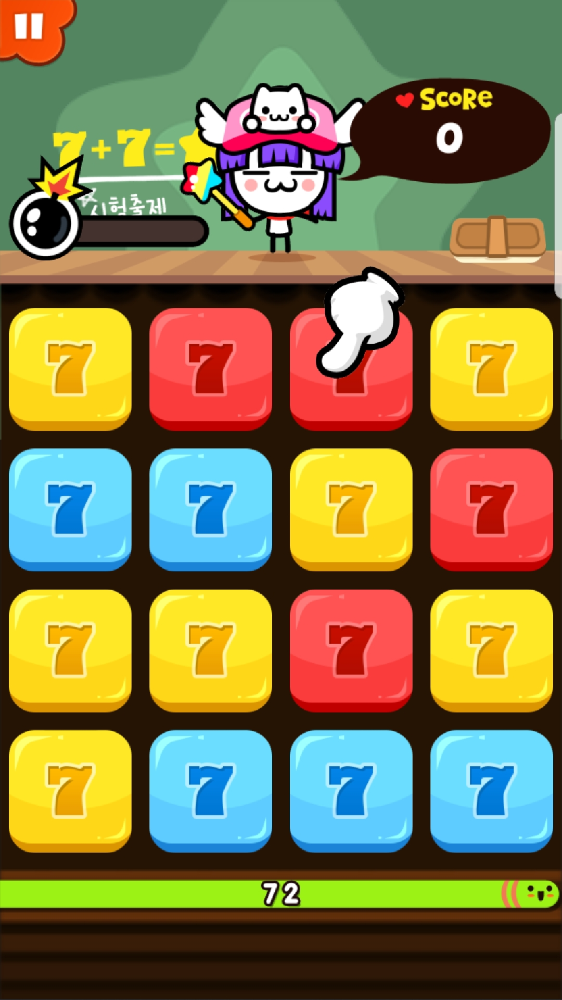
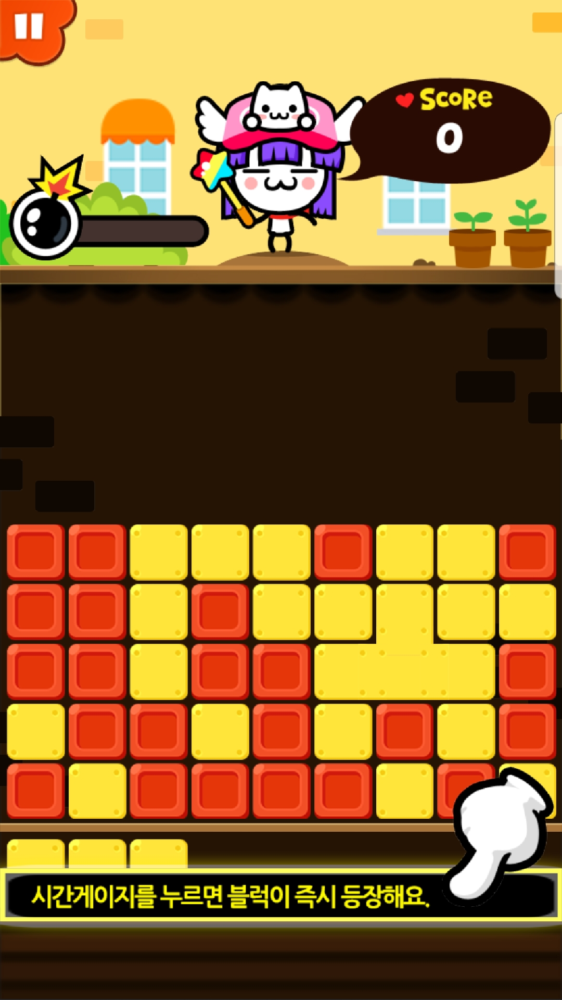
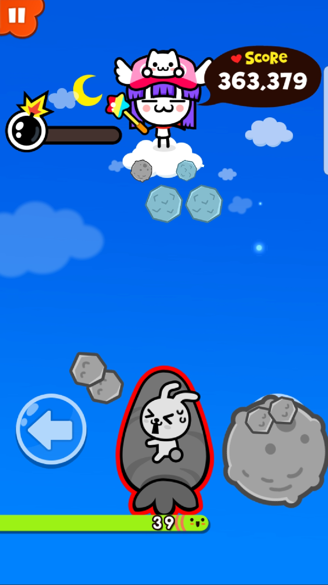
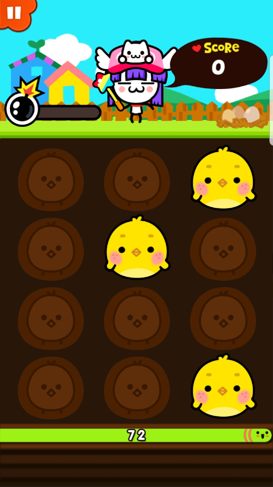
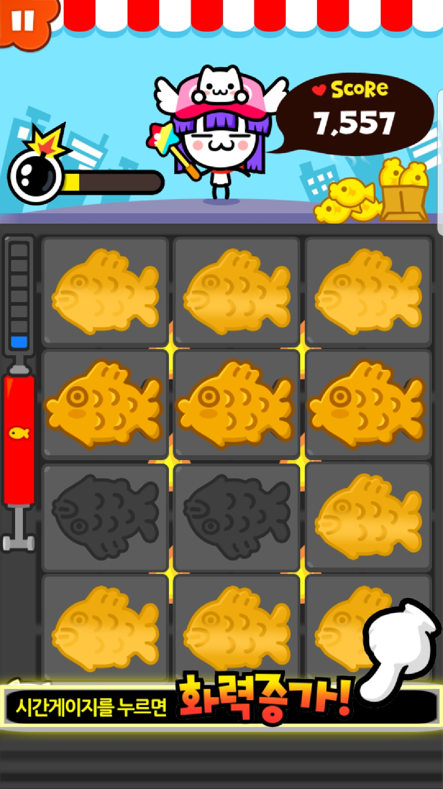
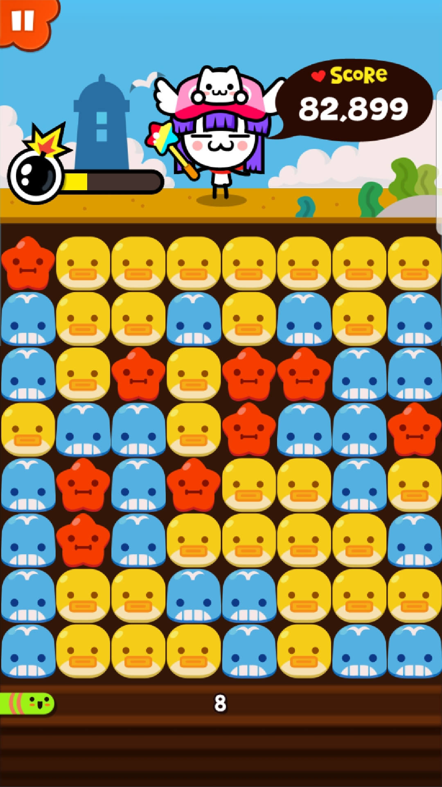
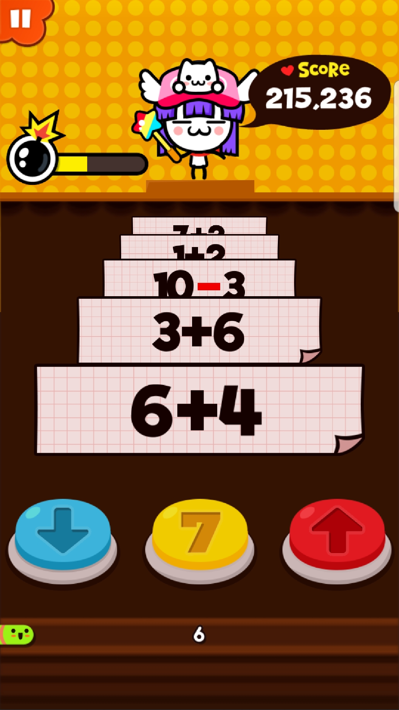
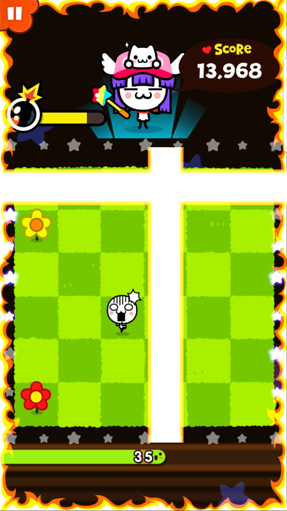

# 눈사라미의 칠칠칠땡
## 게임 방법
 게임이 시작되면 4X4로 된 정사각형의 퍼즐모양이 나옵니다. 각 칸에는 숫자7이 빨강색, 파란색, 노란색 중 랜덤으로 나옵니다. 같은 색깔 7 2개가 모이면 77, 같은 색깔 77 2개가 모이면 별, 같은 색깔 별2개가 모이면 사라지면서 점수를 얻게 됩니다.
## 그래픽

## 점수 계산
연속으로 숫자를 맞추는데 성공할 시 스택이 올라가며 일정 수 이상으로 스택이 쌓이면 피버, 슈퍼피버, 울트라피버가 나오며 추가 점수를 얻게 됩니다. 게임 중간중간마다 폭탄 스택이 다 차면 폭탄이 16개의 칸 중 빈 칸에 랜덤으로 생성되며 폭탄을 터트릴 시 폭탄 주변의 8개의 숫자가 사라지며 10초의 추가 시간을 얻게 됩니다.
## 게임 아이템  
### 원블록  
무조건 한 가지 색상으로 시작하는 아이템(1000골드)
### 스피드
블록의 등장 시간을 단축시키는 아이템(블록이 더 자주 생성된다는 것)(1100골드)
### 단계통일  
높은레벨의 블록이 나오는 아이템(7<77<777이므로 7보다 큰 숫자의 블록이 생성)(1000골드)
### 슈퍼피버시작
슈퍼피버가 끊기지 않고 계속 이어지게 하는 아이템(보석1개)

# 카카오의 뽀샤뽀샤
## 게임 방법
게임이 시작하면 포트리스와 비슷한 화면이 나타나며 빨강색,노랑색,파랑색,초록색으로 이루어진 블록이 생성된다. 같은 블록끼리 서로 연결되어 있는 블록을 터치하면 블록이 사라지며 점수를 얻는 게임이며 블록을 제거하지 못하고 블록이 끝까지 도달하거나 시간이 0이 되면 게임이 종료된다. 또한, 밑에 시간게이지를 누르면 블록이 즉시 등장한다.
## 그래픽

## 점수 계산
같은 색깔끼리 연결되어 있는 블록을 제거하면 점수를 얻을 수 있고 블록을 연속으로 파괴할 시, 피버, 슈퍼 피버, 울트라 피버로 연결이 된다. 피버에서 울트라 피버로 갈수록 추가 점수를 더 많이 획득할 수 있다. 게임을 플레이하는 동안 폭탄이나, 화살표 모양의 아이템이 등장할 때가 있다. 폭탄버튼의 아이콘을 터치하면 폭탄이 터지면서 시간이 10초 추가되고 주변의 블록을 파괴한다. 화살표 모양의 아이콘을 터치하면 상하좌우의 블록이 모두 파괴되지만 추가 시간은 주어지지 않는다.
## 게임 아이템
### 방어
블록이 쌓여도 1회 방어해주는 아이템(1200골드)
### 뿅망치
누르는 모든 블록을 없애주는 아이템(900골드)
### 번개
붙어있는 블록을 모두 쪼개주는 아이템(1100골드)
### 슈퍼피버시작
끊기지 안흔 슈퍼피버(보석1개)

# 삐끼의 고향방문
## 게임 방법
게임이 시작되면 플레이하는 캐릭터는 당근에 탑승한 모션을 취한다. 좌우 화살표로 총 3개의 칸들 중 원하는 곳으로 움직일 수 있다. 전방에 2개의 운석이 날라오는데 이 운석을 피하기 위해 운석이 날아오지 않는 곳으로 피해야 한다.
## 그래픽

## 점수 계산
이 게임은 운석을 피할 때마다 점수를 주는 게임이 아닌 시간에 따라 점수를 준다. 시간이 지날수록 운석이 날아오는 속도가 빨라지며 그에 따라 점수를 추가적으로 주게 된다. 밑에 있는 시간 카운터를 누르면 운석이 날아오는 속도가 더 증가하게 된다. 하지만 게임을 하는 도중 운석에 충돌할 경우 게임을 처음 시작했을 때와 같은 속도로 운석이 날아오게 되고 점수 또한 처음과 같은 속도로 오르게 된다. 폭탄 스텍이 차서 폭탄이 나온 경우 폭탄을 먹으면 10초의 추가 시간과 전방에 날아오는 운석이 파괴되며 별 모양의 아이템을 먹을 시 운석이 별로 변하고 이 별을 먹을 경우 추가 점수를 얻게 된다. 피버, 슈퍼피버, 울트라피버가 있다.
## 게임 아이템
### 곰젤리
지나가야 할 길을 알려주는 아이템(운석이 나오지 않는 길을 알려줌)(1200골드)
### 방어
운석에 부딪혀도 1번 방어해주는 아이템(900골드)
### 보너스타임
게임을 5초 연장시켜주는 아이템(1100골드)
### 슈퍼피버시작
슈퍼피버가 계속되는 아이템(보석 1개)

# 양치기의 치킨치킨
## 게임 방법
게임이 시작되면 3X4로 이루어진 직사각형이 생성된다. 처음에는 모두 빈칸으로 시작되며 게임이 시작된 후 노랑 병아리, 빨강 병아리, 파랑 병아리가 나온다. 병아리들이 나온 후 다시 사라지는데 병아리들이 있었던 자리들을 터치해주면 되는 게임이다. 노랑 병아리는 터치 1번, 빨강 병아리는 터치 2번, 파랑 병아리는 터치 3번이다.
## 그래픽

## 점수 계산
병아리들이 있었던 자리를 터치하면 점수를 얻게 된다. 노랑 병아리는 1번, 빨강 병아리는 2번, 파랑 병아리는 3번 터치를 해야 하기 때문에 노랑<빨강<파랑 순으로 추가 점수를 얻게 된다. 폭탄 스텍이 다 차면 모든 칸에 폭탄이 생성되며 이 폭탄을 모두 클릭할 시 점수를 얻으며 10초의 추가 시간을 얻게 된다. 피버, 슈퍼피버, 울트라피버가 있다. 잘못 클릭하면 피버 스텍이 모두 사라지게 된다.
## 게임 아이템
### 정리정돈
맞추기 쉬운 배열이 등장하는 아이템(900골드)
### 방어
잘못된 선택을 방어해주는 아이템(1200골드)
### 보너스타임
게임시간을 5초 연장해주는 아이템(1100골드)
### 슈퍼피버시작
슈퍼피버가 끊기지않는 아이템(보석 1개)

# 붕어빵타이쿤
## 게임 방법
게임이 시작되면 3X4 모양의 붕어빵 기계가 생성된다. 게임을 시작하고 칸을 클릭 하면 밀가루와 팥이 들어가고 일정 시간이 지나면 색깔이 좀 더 어두워진다. 이 때 붕어빵을 클릭하면 붕어빵이 뒤집어지고 일정 시간이 지나면 붕어빵이 완전한 갈색으로 바뀌었을 때 클릭하면 완성된 붕어빵이 생성되며 점수를 획득하게 된다. 하지만 완성된 붕어빵을 오랫동안 클릭하지 않을 경우 붕어빵이 타서 일정 시간 동안 그 칸에서는 붕어빵을 만들지 못한다. 밑의 시간게이지를 누르면 화력이 증가되어 붕어빵이 더 빨리 익게 된다.
## 그래픽

## 점수 계산
연속으로 붕어빵을 완벽히 익힐 시 스텍이 쌓이며 이 스텍이 증가할수록 피버, 슈퍼피버, 울트라피버가 되며 울트라피버로 갈수록 추가점수를 획득하게 된다. 하지만 완벽히 익히지 않은 붕어빵을 클릭할경우 스텍이 초기화된다.
## 게임 아이템
### 틀강화
연기가 나도 틀이 한번 고장나지 않는 아이템(900골드)
### EXO오일
밑의 시간게이지를 누르지 않아도 화력이 최대로 고정되는 아이템(1200골드)
### 만능긁개
탄 틀을 금방 깨끗하게 해주는 아이템(1100골드)
### 슈퍼피버시작
슈퍼피버가 끊기지 않은 아이템(보석 1개)

# 옆집누나의 어장관리
## 게임 방법
같은 모양의 블록이 양 모서리에 존재할 경우에 양 모서리를 드래그하면 드래그한 만큼의 블록들이 모두 사라지며 점수를 얻게 되는 게임이다. 총 3가지의 블록이 존재한다.(빨강, 파랑, 노랑)
## 그래픽

## 점수 계산
많은 블록들을 드래그할수록 많은 점수를 얻게 된다. 이 게임 또한 스택이 존재하며 스택을 쌓을수록 피버, 슈퍼피버, 울트라피버가 발생한다. 게임을 하다보면 왕관 모양의 아이콘이 생성되며 왕관 모양의 아이콘을 제거할 시 추가점수를 얻게 된다. 폭탄스택이 차서 폭탄이 게임에 등장한 경우 폭탄을 누를 시 주변의 블록들이 파괴되며 10초의 추가 시간을 얻게 된다.
## 게임 아이템
### 천사의 날개
주변 블록을 물들여주는 아이템(같은 색깔로 바꾸어준다.)(900골드)
### 체인지
블록 한 개를 맞추기 쉽게 바꿔주는 아이템(1200골드)
### 핵폭탄
폭탄의 파워가 매우 커지는 아이템(1100골드)
### 슈퍼피버시작
슈퍼피버가 끊기지 않고 계속되는 아이템(보석 1개)

# 삼천만의 구멍수학
## 게임 방법
게임이 시작되면 종이에 숫자가 적혀 있다. 숫자가 7보다 작을 경우 왼쪽 버튼을 숫자가 7일 경우 가운데 버튼, 숫자가 7보다 클 경우 오른쪽 버튼을 누르면 점수를 얻을 수 있다.
## 그래픽

## 점수 계산
문제를 맞출 때마다 스택이 쌓이게 된다. 스택을 쌓을수록 피버, 슈퍼피버, 울트라피버가 발생하며 울트라피버로 갈수록 추가점수를 얻게 된다. 폭탄 스택이 다 차서 폭탄이 생성되면 문제 대신 폭탄이 생성 되고 이 폭탄의 경우 아래,7,위 이 3개의 버튼 중 어느 버튼을 눌러도 상관이 없으며 폭탄이 터지면 10초의 추가시간과 10개의 문제가 사라지게 된다. 문제를 틀리면 게임은 종료되지 않지만 스택이 초기화된다.
## 게임 아이템
### 정답
문제를 답으로 바꿔주는 아이템(-,+가 들어간 문제에 사용하기 좋다)(900골드)
### 방어
잘못된 선택을 방어해주는 아이템(1200골드)
### 핵폭탄
폭탄의 위력이 대폭 증가하는 아이템(1100골드)
### 슈퍼피버시작
슈퍼피버가 끊기지 않게 해주는 아이템(보석 1개)

# 사랑이의 꽃한송이
## 게임방법
6X6 정사각형 모양에 플레이어가 배치됩니다. 게임이 시작된 후 꽃이 랜덤으로 생성되며 캐릭터를 움직여 꽃을 먹으면 점수가 오르게 됩니다. 4~5초마다 레이저 2개가 발사되며 레이저는 직선으로 무한대로 발사되기 때문에 x,y축이 서로 다른 곳에 있어야 피해집니다.
## 그래픽

## 점수 계산
꽃을 먹으면 점수가 증가하며 꽃이 1개,2개,3개가 생성되는데 1개<2개<3개 순으로 추가 점수가 부여됩니다. 폭탄을 먹으면 추가점수는 없으나 시간이 10초 추가됩니다.
## 게임 아이템
### 무적파워
레이저에 맞아도 한번 보호해주는 아이템(900골드)
### 식물영양제
꽃밭에 꽃이 더 많이 생기게 해주는 아이템(1100골드)
### 무지개꽃
주변에 꽃이 생성되는 아이템(1200골드)
### 슈퍼피버시작
슈퍼피버가 끊기지 않게 해주는 아이템(보석 1회)

# 불여우의 짝꿍짝궁
## 게임 방법
게임이 시작되면 다양한 그림이 2개의 짝을 이루어 랜덤으로 배치된다. 그림이 같은 것끼리 터치를 하면 되는데 이 때 주의해야 될 점은 직선으로 3번을 그어서 연결이 될 수 있을 때에만 터치를 하여 제거가 된다. 만약 직선으로 4번 이상 그어야 연결이 된다면 스택이 쌓이지 않고 점수도 증가하지 않는다.
## 그래픽

## 점수 계산
같은 아이콘끼리 짝을 맞추면 점수가 증가합니다. 짝을 맞출 때마다 스택이 증가하며 피버, 슈퍼피버, 울트라피버 순으로 추가점수가 증가합니다. 폭탄 스택이 다 차게 되면 화면에 랜덤으로 폭탄이 생성되고 폭탄을 터트리면 10초의 추가 시간이 주어집니다.
## 게임 아이템
### 초보자
등장하는 블록 난이도가 낮아지는 아이템(900골드)
### 정렬
다섯판 마다 보너스 판이 나오는 아이템(1200골드)
### 빠른힌트
힌트를 더욱 빨리 보여주게 하는 아이템(1100골드)
### 슈퍼피버시작
슈퍼피버가 끊기지 않게 하는 아이템(보석 1회)

# 뚜더지의 뚜벅뚜벅
## 게임 방법
게임이 시작되면 가로 4칸 중 한곳에 두더지가 나타납니다. 화면은 계속 앞으로 전진하고 두더지를 계속 잡아야 하는 게임입니다. 두더지를 잡지 못하면 바로 게임은 종료됩니다.
## 그래픽

## 점수 계산
생성되는 두더지를 누를때마다 스택이 쌓이며 스택이 쌓일수록 피버, 슈퍼피버, 울트라피버로 올라가게 됩니다. 울트라피버로 갈수록 추가점수가 증가하게 됩니다. 폭탄을 누를시 전방의 두더지들이 제거되며 점수가 증가하고 10초의 추가시간이 주어집니다.
## 게임 아이템
### 방어
두더지를 잘못 눌러도 다시 한번 살아나게 해주는 아이템(900골드)
### 콤보배수
콤보가 더 많이 늘게 해주는 아이템(1100골드)
### 슬로우
일정시간동안 느리게 전진하게 해주는 아이템(1200골드)
### 슈퍼피버시작
슈퍼피버가 끊기지 않게 해주는 아이템(보석 1개)
